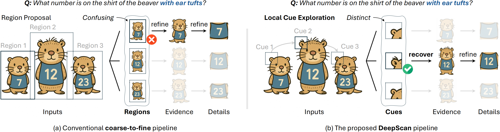

<div align="center">
  <h1>🔎 DeepScan: A Training-Free Framework for Visually Grounded Reasoning in Large Vision-Language Models</h1>
  <p><em>Official implementation of the CVPR 2026 paper</em></p>
  <p>
    <a href="https://arxiv.org/abs/2603.03857"></a>
  </p>
</div>

<p align="center">
  <a href="./figs/teaser.pdf">
    
  </a>
</p>

> **TL;DR.** DeepScan is a **training-free** framework for **visually grounded reasoning** in LVLMs. It follows a **bottom-up** pipeline with **Hierarchical Scanning**, **Refocusing**, and **Evidence-Enhanced Reasoning**, enabling stronger grounded reasoning without any additional training.

---

## 🔥 News
- [ ] **TODO.** Batched Inference.
- [x] **2026-04.** Evaluation scripts are released.
- [x] **2026-03.** The core codebase is open-sourced.
- [x] **2026-02.** DeepScan was accepted to **CVPR 2026** main track.

---

## 👀 Overview

DeepScan improves visually grounded reasoning by decomposing inference into three stages:

1. **Hierarchical Scanning**  
   Discover local visual cues and recover candidate evidence regions.

2. **Refocusing**  
   Search for the smallest complete view that preserves the required context.

3. **Evidence-Enhanced Reasoning**  
   Answer the question using an ordered multi-image evidence memory.

Unlike RL-based grounded reasoning approaches, DeepScan is **plug-and-play** and **training-free**, and can be integrated with different LVLM backbones directly at test time.

---

## 📊 Glance of Results on V*  
*(detailed in [Issue #3](../../issues/3))*

| Backbone | Overall | Direct Attributes | Relative Position |
|----------|---------|-------------------|-------------------|
| Qwen2.5-VL 7B | 90.6 | 92.2 | 88.2 |
| Qwen3-VL 8B | 92.2 | 93.0 | 90.8 |

---

## 🚀 Quick Start

DeepScan requires **three conda environments**:

- `lavis` for the **search expert**
- `langsam` for the **visual expert** and **SAM2**
- `deepscan` for the **main LVLM runtime**

### 1. Clone the repository

```bash
git clone https://github.com/YChenL/DeepScan
cd DeepScan
```

### 2. Create environments

#### Search expert
```bash
conda env create -f lavis.yml
conda activate lavis
```

#### Visual expert
```bash
conda env create -f langsam.yml
conda activate langsam
```

#### Main runtime
```bash
conda env create -f deepscan.yml
conda activate deepscan
```

---

## 🔧 Required Monkey Patch for LAVIS

After creating the `lavis` environment, modify:

```text
your_env_path/lavis/models/blip_models/blip_image_text_matching.py
```

Replace the following lines:

```python
# encoder_input_ids[:, 0] = self.tokenizer.enc_token_id
encoder_input_ids[:, 0] = self.tokenizer.convert_tokens_to_ids("[ENC]")
```

This patch is required by the BLIP-based search expert used in DeepScan.

---

## 📦 Model Preparation

Please download the following checkpoints from Hugging Face:

- [`google-bert/bert-base-uncased`](https://huggingface.co/google-bert/bert-base-uncased)
- [`IDEA-Research/grounding-dino-base`](https://huggingface.co/IDEA-Research/grounding-dino-base)
- [`facebook/sam2.1-hiera-small`](https://huggingface.co/facebook/sam2.1-hiera-small)
- [`facebook/sam2.1-hiera-base-plus`](https://huggingface.co/facebook/sam2.1-hiera-base-plus)
- [`Qwen/Qwen2.5-VL-7B-Instruct`](https://huggingface.co/Qwen/Qwen2.5-VL-7B-Instruct)
- [`Qwen/Qwen3-VL-8B-Instruct`](https://huggingface.co/Qwen/Qwen3-VL-8B-Instruct)

Example:

```bash
huggingface-cli download google-bert/bert-base-uncased \
    --local-dir bert-base-uncased \
    --local-dir-use-symlinks False \
    --resume-download
```

Download the other checkpoints in the same way.

### Additional SAM2 requirement

Please place the checkpoint from:

```text
facebook/sam2.1-hiera-base-plus
```

into the `checkpoints` directory of the installed `sam2` package inside the `langsam` environment.

---

## 🛠 Path Configuration

Before launching DeepScan, replace the local paths in the following files.

### 1. BLIP tokenizer path

File:
```text
code/scripts/blip_server/blip_service.py
```

Set:
```python
LOCAL_TOKENIZER_PATH = "your/local/google-bert/bert-base-uncased/path"
```

### 2. LangSAM / GroundingDINO / SAM2 checkpoint paths

File:
```text
code/scripts/expert_server/model_service.py
```

Example:
```python
self.model = LangSAM(
    sam_type="sam2.1_hiera_small",
    ckpt_path_sam="/your/local/facebook/sam2.1-hiera-small/sam2.1_hiera_small.pt",
    ckpt_path_gdino="/your/local/IDEA-Research/grounding-dino-base"
)
```

### 3. SAM2 repository root

File:
```text
code/scripts/sam2_server/sam2_service.py
```

Set:
```python
SAM2_REPO_ROOT = Path("/your/envs/langsam/lib/python3.11/site-packages/sam2")
```

This should be the absolute path to the installed `sam2` package in your `langsam` environment.

---

## 📂 Dataset Preparation

Please download the evaluation datasets from [`oking0197/Dyfo`](https://github.com/oking0197/Dyfo), then organize them as follows:

```text
DeepScan/
├── code/
│   ├── scripts/
│   └── src/
└── playground/
    └── data/
        └── eval/
            ├── vstar/
            └── ...
```

---

## 🧠 Components

DeepScan uses three components:

### A. Search Expert
We use **BLIP-ITM** to produce patch-wise Grad-CAM attention maps for cue discovery.

### B. Visual Expert
The visual expert provides:

- **point-prompt segmentation**
- **text-conditioned detection**

In our implementation, this is realized by:

- a **LangSAM-based detection service**
- a **SAM2 point-prompt segmentation service**

### C. LVLM Backend
The pipeline supports compatible LVLM backbones such as:

- **Qwen2.5-VL-7B-Instruct**
- **Qwen3-VL-8B-Instruct**

---

## 🚀 Launch Services

DeepScan is a multi-service pipeline. You need to start:

1. the **visual expert server**
2. the **search expert server**
3. the **SAM2 segmentation server**

Below is one example setup using **two RTX 4090 GPUs**:

- `cuda:0` for expert services
- `cuda:1` for the main LVLM runtime

### On `cuda:0`

#### 1. Visual expert server

```bash
conda activate langsam
bash code/scripts/expert_server/start_server.sh
```

Expected log:

```text
Starting server on port 8000
INFO:     Started server process [xxxxx]
INFO:     Waiting for application startup.
INFO:     Port: 8000, Uptime: 0.00s, Current queue size: 0
INFO:     Application startup complete.
INFO:     Uvicorn running on http://0.0.0.0:8000 (Press CTRL+C to quit)
```

#### 2. Search expert server

```bash
conda activate lavis
bash code/scripts/blip_server/start_server.sh
```

Expected log:

```text
Starting server on port 8100
--- loading local tokenizer from: /your/local/bert-base-uncased/ ---
INFO:     Started server process [xxxxx]
INFO:     Waiting for application startup.
INFO:     Application startup complete.
INFO:     Uvicorn running on http://0.0.0.0:8100 (Press CTRL+C to quit)
```

#### 3. SAM2 server

```bash
conda activate langsam
bash code/scripts/sam2_server/start_server.sh
```

Expected log:

```text
Starting server on port 8200
Working directory changed to: /your/envs/langsam/lib/python3.11/site-packages/sam2
INFO:     Started server process [xxxxx]
INFO:     Waiting for application startup.
INFO:     Application startup complete.
INFO:     Uvicorn running on http://0.0.0.0:8200 (Press CTRL+C to quit)
```

> **Note:** Please adjust the ports, CUDA devices, and checkpoint paths in the scripts before launching.

---

## ▶️ Run DeepScan

After the expert services are ready, switch to the main runtime environment and run:

```bash
conda activate deepscan
bash code/scripts/vstar/stream_vstar_qwen.sh oursmcts False
```

Before running, please update the checkpoint path inside the script, e.g.

```bash
CKPT="/your/local/path/for/Qwen-VL"
```

Expected log:

```text
Creating samples: 100%|██████████| 191/191 [00:04<00:00, ...it/s]
Processing samples:   0%|          | 0/191 [00:00<?, ?it/s]
Loading checkpoint shards: 100%|██████████| 4/4 [00:03<00:00, ...it/s]
The following generation flags are not valid and may be ignored: ['temperature', 'top_p', 'top_k'].
...
```

You may also invoke the main entry point directly through `code/src/run.py`, depending on your local setup.

---

## 📊 Resource Usage

A typical setup can run on **2 × RTX 4090**.

Example `nvidia-smi` snapshot:

```text
+-----------------------------------------------------------------------------------------+
| GPU  Name                 Memory-Usage |
| 0    NVIDIA GeForce RTX 4090   11199MiB / 24576MiB |
| 1    NVIDIA GeForce RTX 4090   17307MiB / 24576MiB |
+-----------------------------------------------------------------------------------------+
```

A practical allocation is:

- **GPU 0**: visual expert + search expert + SAM2 server
- **GPU 1**: Qwen-VL main runtime


### ⏱ Runtime

- On **2 × RTX 4090**, evaluating **V\*** takes about **3 hours** in total, which is roughly **1 minute per sample**.
- On **4 × RTX 4090**, one GPU can be used to host the expert servers, while the remaining **three GPUs** run the main evaluation with **DDP-based data splitting**.
- Under this 4-GPU setup, the runtime is reduced to about **20 seconds per sample**, which is close to the efficiency reported in the paper.

---

## ⚡ Efficiency Notes

DeepScan is a **test-time scaling** framework. Its inference cost is higher than one-shot inference, but it provides a clear performance-efficiency trade-off through:

- patch size
- retained evidence count `k`
- batched engineering optimizations

The optimized implementation benefits from:

- batched attention-map computation
- batched top-k evidence judgment
- batched view justification
- vLLM-based serving

---

## 🙏 Acknowledgements

DeepScan builds on several excellent open-source projects and model ecosystems. We especially thank **[DyFo](https://github.com/PKU-ICST-MIPL/DyFo_CVPR2025)** for its inspiring open-source release.

We also acknowledge:

- **Qwen2-VL / Qwen2.5-VL / Qwen3-VL**
- **LAVIS**
- **LangSAM**
- **SAM2**
- **vLLM**

---

## 📜 Citation

If you find DeepScan useful, please cite:

```bibtex
@article{li2026deepscan,
  title={DeepScan: A Training-Free Framework for Visually Grounded Reasoning in Large Vision-Language Models},
  author={Li, Yangfu and Zhan, Hongjian and Chen, Jiawei and Gong, Yuning and Liu, Qi and Lu, Yue},
  journal={arXiv preprint arXiv:2603.03857},
  year={2026}
}
```
